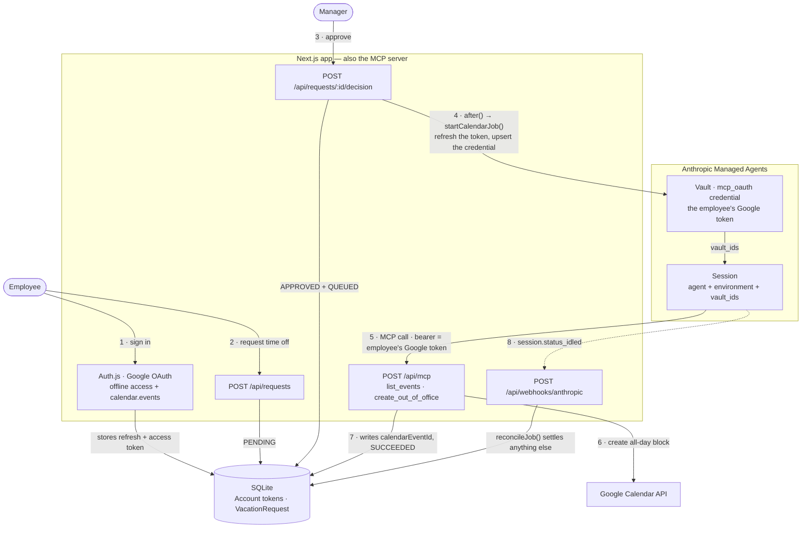

# Vacation Scheduler

A time-off app where the last mile is done by an agent. Employees sign in with Google and request
time off, a manager approves or denies it, and approval hands the work to an
[Anthropic Managed Agent](https://platform.claude.com/docs/en/managed-agents/overview). The agent
connects back to this app's own MCP server, checks the employee's calendar, and creates an all-day
out-of-office block using that employee's Google OAuth token.

It is a working sample of the pattern: **your app is the MCP server, the agent is the worker, and
the user's own credential is what the agent acts with.**

- **Stack** — Next.js 16 (App Router) · Tailwind v4 + shadcn/ui · Auth.js v5 (Google) · Prisma 7 +
  SQLite · `@anthropic-ai/sdk` (Managed Agents beta) · `mcp-handler` (Streamable HTTP MCP)
- **Requirements** — Node 20+, a Google Cloud OAuth client with the Calendar API enabled, an
  Anthropic API key, and `cloudflared` for the public tunnel

## Table of contents

- [The frontend](#the-frontend)
- [Architecture](#architecture)
- [The agent loop](#the-agent-loop)
- [Running it](#running-it)
- [Environment variables](#environment-variables)
- [Commands](#commands)
- [Troubleshooting](#troubleshooting)

## The frontend

The whole Next.js app lives in [frontend/](frontend/). Everything else in the repo — Prisma,
scripts, the agent definition, `.env` — sits at the root, and every command runs from there.

Three screens, all server components reading Prisma directly:

| Route | Who | What it does |
|---|---|---|
| [/login](frontend/src/app/login/page.tsx) | anyone | One "Continue with Google" button. Refuses the sign-in if Google withheld the refresh token or the calendar scope, and explains why |
| [/requests](frontend/src/app/(app)/requests/page.tsx) | employee | Submit a request, then watch its approval status and its calendar status side by side |
| [/manage](frontend/src/app/(app)/manage/page.tsx) | manager | Pending requests as cards with Approve/Deny, plus the 50 most recent decisions |

Mutations are plain `fetch` calls from small client components to route handlers, followed by
`router.refresh()`. There is no client-side store.
[RequestForm](frontend/src/components/request-form.tsx) is a dialog with a two-month range picker
that sends the browser's IANA time zone along with the dates.
[DecisionButtons](frontend/src/components/decision-dialog.tsx) collects an optional note before
approving or denying.

The interesting part of the UI is that **a request carries two independent statuses**.
[StatusBadge](frontend/src/components/status-badge.tsx) shows the approval decision.
[CalendarSyncBadge](frontend/src/components/status-badge.tsx) shows the agent's progress: a spinner
while queued or running, a link straight to the Google Calendar event on success, and the agent's
own error text on failure with a "Retry calendar" button next to it. While any job is in flight,
[AutoRefresh](frontend/src/components/job-actions.tsx) re-renders the page every ten seconds so the
spinner resolves on its own.

## Architecture



The app is on both ends of the loop: it starts the session, and it serves the MCP tools the agent
then calls back into. Steps 6 and 7 are why the arrows converge — the tool call itself creates the
event **and** records it, so the app never has to read the outcome out of the agent's reply.

**Auth.** [frontend/src/auth.ts](frontend/src/auth.ts) requests
`https://www.googleapis.com/auth/calendar.events` with `access_type=offline` and `prompt=consent`,
because Google only issues a refresh token on a consent screen. The Prisma adapter stores tokens
only when an account is first linked, so the `signIn` callback rewrites them on every sign-in.
Emails listed in `MANAGER_EMAILS` are promoted to `MANAGER` when their user row is created.

**Data model.** [prisma/schema.prisma](prisma/schema.prisma) keeps the Auth.js tables plus
`VacationRequest`. The approval decision (`status`) and the calendar sync (`calendarJobStatus`) are
**separate state machines**. A failed sync never rolls back an approval; it just offers a retry, up
to three attempts. Vault ids are cached on `User`, and `ProcessedWebhook` dedupes webhook
deliveries by event id.

**Dates are date-only.** Stored as UTC midnight, moved around as `YYYY-MM-DD` strings
([dates.ts](frontend/src/lib/dates.ts)). Google's all-day `end.date` is exclusive, and that `+1` day
happens in exactly one place, [gcal.ts](frontend/src/lib/gcal.ts), so it can't drift.

**The MCP server** is [frontend/src/app/api/mcp/route.ts](frontend/src/app/api/mcp/route.ts), built
with `mcp-handler` and exposing two tools:

- `list_events(start_date, end_date)` — the employee's events over a range
- `create_out_of_office(request_id, start_date, end_date, summary?)` — one all-day busy block,
  tagged with `extendedProperties.private.vacationRequestId`

The bearer token on these calls is the **employee's Google access token**, injected by Anthropic
from the session's vault. `verifyToken` resolves it to a `User` through Google's userinfo endpoint,
so the token identifies the caller rather than the app trusting a name the agent supplied.

Agent input is untrusted, so `create_out_of_office` re-checks everything before it writes: the
request must exist, belong to the token's user, be `APPROVED`, and the dates must match what is
stored. It is also idempotent per `request_id` and **records `calendarEventId` in the database
itself** — the app never parses agent prose to find out what happened.

## The agent loop

The loop lives in [frontend/src/lib/calendar-agent.ts](frontend/src/lib/calendar-agent.ts) and has
two halves: one that starts a session, one that decides how it ended.

### 1. Approval starts a job

The [decision route](frontend/src/app/api/requests/[id]/decision/route.ts) uses
`updateMany({ where: { status: "PENDING" } })` as its idempotency guard, so a double-click returns
409 instead of approving twice. On approval it schedules `startCalendarJob` with Next's `after()`,
which returns the response immediately and runs the job afterwards.

`startCalendarJob` then:

1. **Refreshes the employee's Google token**
   ([google-token.ts](frontend/src/lib/google-token.ts)). An `invalid_grant` clears the stored
   refresh token and fails the job with a message telling the manager to have the employee sign in
   again.
2. **Upserts a vault credential** ([vault.ts](frontend/src/lib/vault.ts)). Each user gets an
   Anthropic vault holding one `mcp_oauth` credential keyed to `MCP_PUBLIC_URL`, carrying the access
   token, its expiry, and the refresh token plus Google's token endpoint so Anthropic can refresh it
   mid-session. `mcp_server_url` is immutable on a credential, so a changed MCP URL means archive
   and recreate.
3. **Creates a session** with the agent id, the environment id, `vault_ids`, and an
   `initial_events` user message built by `buildTaskMessage` — the request id, employee email,
   dates, time zone, and reason as literal key/value lines. The session's trace URL is logged.

### 2. The agent works

The agent definition is [agent-definition.ts](frontend/src/lib/agent-definition.ts), mirrored for
humans in [agent.md](agent.md). Its system prompt is a four-step procedure: list events, stop if a
block for this `request_id` already exists, otherwise call `create_out_of_office` exactly once with
the values passed verbatim, then reply with `EVENT_ID: <id>`.

Two details matter more than the prompt:

- `mcp_servers` and a matching `mcp_toolset` must **both** be present, and the toolset's
  `mcp_server_name` must match the server name. A mismatch produces a session that never calls a
  tool.
- Every tool config sets `permission_policy: always_allow`. Anything else leaves an unattended
  session parked on a permission prompt forever. `default_config.enabled: false` keeps the surface
  to just those two tools.

The agent has no built-in tools — no bash, no file access. Its entire capability is the two MCP
tools, acting through one employee's token.

### 3. Reconciliation closes the job

Because `create_out_of_office` writes `calendarEventId` itself, success is already recorded in the
database before the session ends. Reconciliation exists to catch everything else.

`reconcileJob` re-reads the request, and if there is no event id, streams the session's events to
work out why. It distinguishes the failure modes that actually happen:

| Signal | Diagnosis |
|---|---|
| `session.error` | Vault or MCP URL problem, surfaced with its error type |
| `agent.mcp_tool_result.is_error` | The tool ran and failed; the Google error is reported verbatim |
| Idle session with a pending `agent.mcp_tool_use` | The permission policy is not `always_allow` |
| Still running past ten minutes | Timed out |
| Finished with no event | The agent's last message becomes the error text |

It is triggered three ways, all converging on the same function: the
[webhook](frontend/src/app/api/webhooks/anthropic/route.ts) on `session.status_idled` and
`session.status_terminated` (deduped through `ProcessedWebhook`), the manager's "Refresh" button via
`reconcileStaleJobs`, and the polling loop in [verify-e2e.ts](scripts/verify-e2e.ts). Without a
webhook signing key configured the route returns 503 and the app falls back to polling.

> **Production note.** Local dev runs jobs through `after()`, which is not durable. For production,
> put `startCalendarJob` behind a real queue and keep `calendarJobStatus` as the state machine — the
> rest of the design already assumes jobs can be retried and reconciled out of band.

## Running it

`make up` does the whole dance: migrations, tunnel, dev server, and it rewrites `MCP_PUBLIC_URL`
and re-applies the Anthropic environment and agent to match. The one thing it cannot do is register
the Console webhook, because there is no API for that.

**1. Configure the environment**

```bash
cp .env.example .env
npx auth secret          # prints AUTH_SECRET
```

Fill in `AUTH_SECRET`, `GOOGLE_CLIENT_ID`, `GOOGLE_CLIENT_SECRET`, `ANTHROPIC_API_KEY`, and
`MANAGER_EMAILS`. Keep `.env` at the repo root — the app, Prisma, and the scripts all read that one
file.

**2. Set up Google Cloud**

In a Google Cloud project: enable the **Google Calendar API**, configure the OAuth consent screen
with the scope `https://www.googleapis.com/auth/calendar.events`, and create a **Web application**
OAuth client with these redirect URIs:

```
http://localhost:3000/api/auth/callback/google
https://<your-public-host>/api/auth/callback/google
```

While the consent screen is in Testing, add yourself as a test user and note that refresh tokens
expire after seven days.

**3. Get a stable tunnel hostname (recommended)**

Anthropic's servers must reach your MCP route, so localhost alone will not do. A named
`cloudflared` tunnel keeps the same hostname across restarts, which matters because the URL is baked
into the agent definition, into every vault credential, and into the webhook you register by hand.

```bash
brew install cloudflared
cloudflared tunnel create vacation-mcp     # then route a hostname to it
```

Put the name and hostname in `.env` as `TUNNEL_NAME` and `TUNNEL_HOSTNAME`. Leave them empty and
`make up` falls back to a throwaway quick tunnel with a new hostname every restart.

**4. Start everything**

```bash
make up
```

This applies migrations, starts the tunnel and the dev server, writes `MCP_PUBLIC_URL`, and runs
`setup:anthropic --write` to create or update the environment and agent and record their ids in
`.env`. It prints the app URL, the MCP URL, and the webhook URL, then waits for the tunnel to answer
on the MCP route — **HTTP 401 there is the correct answer**, since the route rejects requests with
no bearer token.

**5. Register the webhook**

In the Claude Console under **Manage → Webhooks**, point an endpoint at
`https://<your-public-host>/api/webhooks/anthropic` for `session.status_idled` and
`session.status_terminated`, and put its `whsec_` secret in `ANTHROPIC_WEBHOOK_SIGNING_KEY`. Skip
this and the app polls instead, which works but is slower.

**6. Try it**

Open http://localhost:3000, sign in with a `MANAGER_EMAILS` address, and accept the calendar
permission. Submit a request from **My requests**, then approve it from **Approvals** and watch the
Calendar column go from a spinner to a link to the real event.

To exercise the same path without the browser:

```bash
make e2e EMAIL=you@example.com
```

This creates an already-approved request, runs the agent, polls until the job settles, then fetches
the event back from Google and asserts its dates match. The Makefile rotates the start date so
consecutive runs do not collide with the agent's duplicate check.

## Environment variables

| Variable | Required | Notes |
|---|---|---|
| `DATABASE_URL` | yes | `file:./dev.db`, relative to the repo root |
| `AUTH_SECRET` | yes | `npx auth secret` |
| `AUTH_TRUST_HOST` | yes | `true`, so Auth.js works on localhost and the tunnel host |
| `GOOGLE_CLIENT_ID` / `GOOGLE_CLIENT_SECRET` | yes | Web OAuth client, Calendar API enabled |
| `MCP_PUBLIC_URL` | yes | `https://<host>/api/mcp`. Written by `make up` |
| `ANTHROPIC_API_KEY` | yes | Optional if you are logged in with `ant auth login` |
| `ANTHROPIC_ENVIRONMENT_ID` | yes | Written by `setup:anthropic --write` |
| `VACATION_AGENT_ID` | yes | Written by `setup:anthropic --write` |
| `MANAGER_EMAILS` | yes | Comma-separated; these addresses get the `MANAGER` role |
| `ANTHROPIC_WEBHOOK_SIGNING_KEY` | no | Without it the app polls instead of reacting |
| `ANTHROPIC_WORKSPACE_ID` | no | Only used to build session trace URLs |
| `TUNNEL_NAME` / `TUNNEL_HOSTNAME` | no | A named tunnel, so the hostname survives restarts |

## Commands

All of these run from the repo root.

| Command | What it does |
|---|---|
| `make up` / `make down` / `make restart` | Start or stop the tunnel, dev server, and Anthropic setup |
| `make status` | Which services are up, whether the MCP route is reachable, which ids are set |
| `make logs` | Follow the dev server and tunnel logs from `.run/` |
| `make e2e EMAIL=...` | Full approval → agent → Google Calendar check |
| `make setup` | Re-apply the environment and agent from the current `.env` |
| `make check` | `npm run typecheck && npm run lint` |
| `npm run dev` | `next dev frontend` on http://localhost:3000 |
| `npm run db:migrate` / `db:seed` / `db:studio` | Prisma migrate, promote managers, browse the data |
| `npm run setup:anthropic -- --write` | Create or update the environment and agent, write ids to `.env` |
| `npm run verify:e2e -- --email you@example.com` | The end-to-end check directly |

`npm install` also runs `prisma generate`, which writes the client into
`frontend/src/generated/prisma`.

## Troubleshooting

Start with the session trace URL logged when the session is created
(`https://platform.claude.com/workspaces/<ws>/sessions/<id>`). The session's event stream usually
names the problem outright.

**`sessions.create` fails with 400, "MCP server host(s) blocked by environment network policy."**
The environment's network policy gates the MCP host. [environment.yaml](environment.yaml) uses
`networking: unrestricted`; under `limited` the host must be in `allowed_hosts` or
`allow_mcp_servers` must be `true`. Run `npm run setup:anthropic` to re-apply the config over any
Console drift. The change affects new containers only.

**Job fails with an `mcp_authentication_failed_error` or `mcp_connection_failed_error`.** The vault
credential does not match the MCP URL, or the tunnel is down. An invalid credential does not block
session creation — it surfaces later as a `session.error`. Confirm the route is reachable with
`make status`, which expects a 401.

**The session runs but never calls a tool.** The toolset name does not match the MCP server name.
Both live in [agent-definition.ts](frontend/src/lib/agent-definition.ts); re-apply with `make setup`.

**The session goes idle with a tool call pending.** A tool's permission policy is not
`always_allow`, so it is waiting for an approval nobody will give. `reconcileJob` detects this case
and says so in the error text.

**"Google connection expired or was revoked."** The refresh token is gone — commonly a Testing-mode
consent screen after seven days. The employee signs in again and the job can be retried.

**Sign-in bounces with `NoRefreshToken` or `NoCalendarScope`.** Google did not grant offline access
or the calendar scope. Sign in again and accept everything; revoking the app's access at
myaccount.google.com first will force a fresh consent screen.

**A tool call returns a Google error.** The error text is passed through verbatim to the request's
Calendar column, and the full error is in the Next.js server log.

## References

- [Managed Agents overview](https://platform.claude.com/docs/en/managed-agents/overview)
- [MCP connector](https://platform.claude.com/docs/en/managed-agents/mcp-connector) ·
  [Vaults](https://platform.claude.com/docs/en/managed-agents/vaults) ·
  [Webhooks](https://platform.claude.com/docs/en/managed-agents/webhooks)
- [mcp-handler](https://github.com/vercel/mcp-handler)
